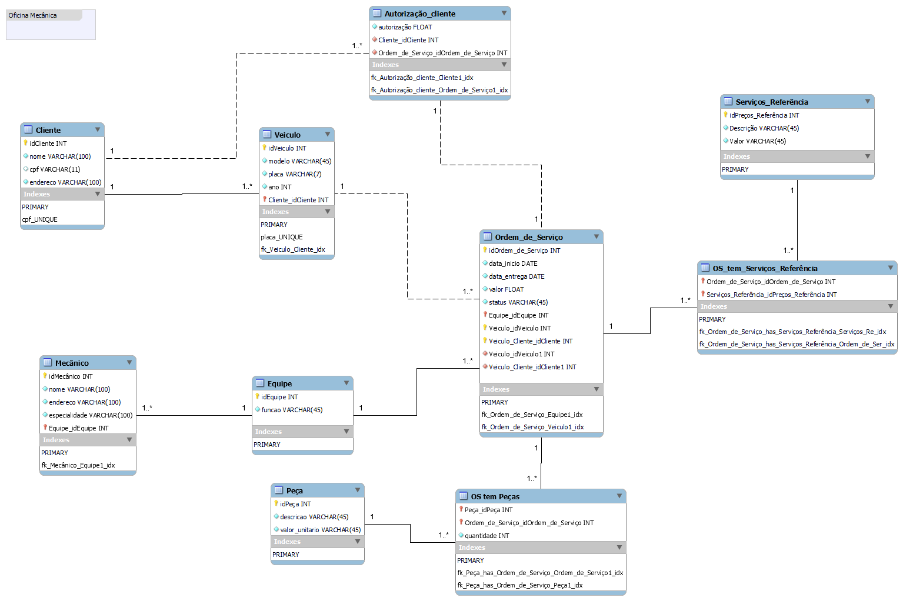

# 🔧 Narrativa Oficina:

## Sistema de controle e gerenciamento de execução de ordens de serviço em uma oficina mecânica

- Clientes levam veículos à oficina mecânica para serem consertados ou para passarem por revisões  periódicas
- Cada veículo é designado a uma equipe de mecânicos que identifica os serviços a serem executados e preenche uma OS com data de entrega.
- A partir da OS, calcula-se o valor de cada serviço, consultando-se uma tabela de referência de mão-de-obra
- O valor de cada peça também irá compor a OSO cliente autoriza a execução dos serviços
- A mesma equipe avalia e executa os serviços
- Os mecânicos possuem código, nome, endereço e especialidade
- Cada OS possui: n°, data de emissão, um valor, status e uma data para conclusão dos trabalhos.

## 📐 Modelo

## 📖 Explicação
### 🧑‍💼🙋 Cliente

Proprietário do veículo. Ele pode ter vários veículos cadastrados. Possui dados básicos de contato (nome, endereço, telefone). É a entidade forte que dá origem ao relacionamento com Veículo.

#### Modelagem usada:

- Cliente (idCliente PK, nome, endereço, telefone).
- Cardinalidade: 1 Cliente → N Veículos.

### 🚗 Veículo
Associado a um cliente específico. Um véiculo pode gerar várias Ordens de Serviço (OS) ao longo do tempo. Possui informações como placa, modelo e ano.
É essencial para vincular OS, pois todos os serviços e peças estão ligados ao veículo.

#### Modelagem usada:

- Veiculo (idVeiculo PK, placa, modelo, ano, idCliente FK).
- Cardinalidade: 1 Veículo → N Ordem de Serviço.

### 🧑‍🔧 Mecânico

Funcionário da oficina, com código, nome, endereço e especialidade. Pode estar associado a uma equipe e uma equipe pode ter vários mecânicos.

#### Modelagem usada:

- Mecanico (idMecanico PK, nome, endereço, especialidade).
- Cardinalidade: N Mecânicos → 1 Equipe.

### 👥 Equipe

Representa o grupo de mecânicos designados para uma OS. Uma equipe pode atender várias Ordens de Serviço. A mesma equipe que avalia os serviços é a que executa.

#### Modelagem usada:

- Equipe (idEquipe PK).
- Relacionamento N:M entre Equipe e Mecânico, implementado com FK.
- Cardinalidade: 1 Equipe → N OS.

### 📑 Ordem de Serviço (OS)

Documento central do processo da oficina. Criada a partir da avaliação da equipe sobre o veículo. Contém data de emissão, status, valor total e data de conclusão.

Só existe se houver Veículo/cliente → entidade fraca.
Relaciona-se tanto com serviços de referência quanto com peças.

#### Modelagem usada:

- OS (idOS PK, dataEmissao, status, valorTotal, dataConclusao, idVeiculo FK, idEquipe FK).
- Cardinalidade: 1 OS → N Peças e N Serviços.

### ⚡ Autorização do Cliente

É uma entidade fraca pois depende de duas entidades fortes (OS e Cliente). Ela registra a aprovação para a execução dos serviços, incluindo os valores das peças e da mão de obra. 

#### Modelagem usada:
- Autorização: float
- Cardinalidade: 1 Cliente → N Autorizações e 1 OS → 1 Autorização.

### 🛠️ Serviço de Referência

Tabela de referência de mão-de-obra. Contém descrição e valor do serviço (ex.: troca de óleo). 

#### Modelagem usada:

- ServicoReferencia (idServico PK, descricao, valorMaoDeObra).
- Tabela associativa: OS_Servico (idOS FK, idServico FK, quantidade).
- Cardinalidade: Associado a OS por meio de uma relação N:M.

### 🔩 Peça

Representa as peças utilizadas na execução de uma OS. Cada peça possui descrição e valor unitário.

#### Modelagem usada:

- Peca (idPeca PK, descricao, valorUnitario).
- Tabela associativa: Peca_OS (idPeca FK, idOS FK, quantidade).
- Cardinalidade: Relaciona-se com OS por meio de uma tabela intermediária (N:M).