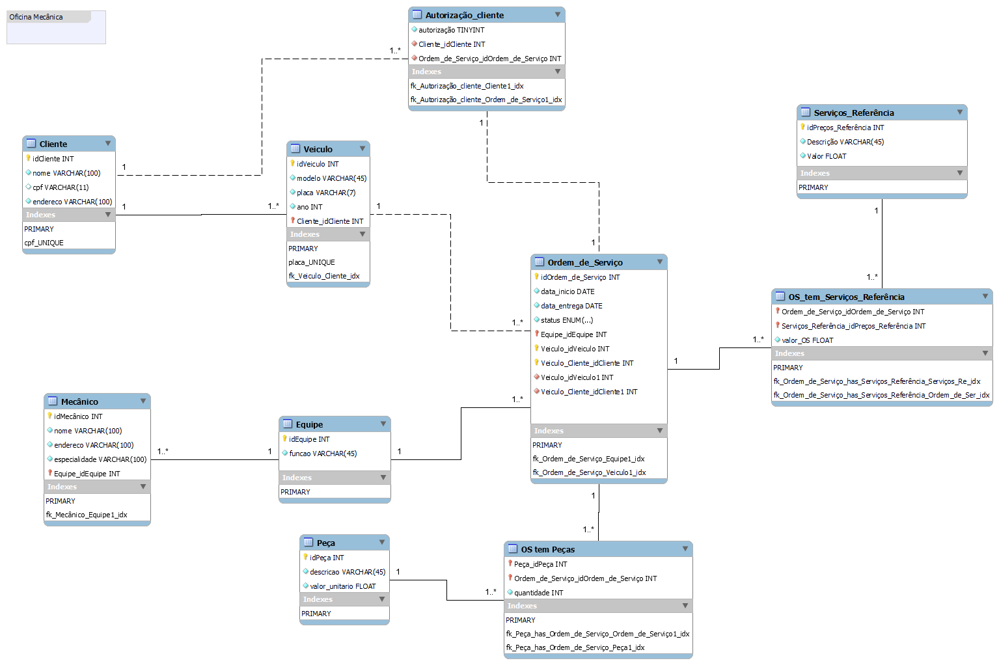

# Sistema de Oficina Mecânica - Projeto de Banco de Dados

## 📋 Descrição do Projeto

Este projeto implementa um sistema de banco de dados para gerenciamento de oficina mecânica, controlando clientes, veículos, mecânicos, equipes, ordens de serviço, peças, serviços de referência e autorizações de serviços.

## 🏗️ Estrutura do Banco de Dados

## 📐 Modelo

### Scripts

- oficina_script - criação do banco de dados [📁 Ver Script 1](./assets/oficina_script.sql) 
- oficina_script_pop - populando banco de dados [📁 Ver Script 2](./assets/oficina_script_pop.sql)
- oficina_script_op - script de consultas  [📁 Ver Script 3](./assets/oficina_script_op.sql)  

### Principais Tabelas

- **Cliente**: Dados dos clientes (nome, CPF, endereço)
- **Veiculo**: Informações dos veículos (modelo, placa, ano) vinculados aos clientes
- **Equipe**: Equipes de trabalho organizadas por função especializada
- **Mecanico**: Dados dos mecânicos e suas especialidades, vinculados às equipes
- **Peca**: Catálogo de peças com descrição e valores unitários
- **Servico_Referencia**: Tabela de preços de referência para serviços padrão
- **OS**: Ordens de serviço com controle de datas, status e responsáveis
- **Referencia_OS**: Relacionamento entre ordens de serviço e serviços realizados
- **Peca_OS**: Controle de peças utilizadas em cada ordem de serviço
- **Autorizacao**: Controle de autorizações dos clientes para execução dos serviços

## 🔍 Queries Implementadas

### Perguntas Respondidas:

1. **Quais são todos os clientes cadastrados?**
2. **Quais veículos estão cadastrados no sistema?**
3. **Quais veículos foram fabricados após 2017?**
4. **Qual o valor total de peças por ordem de serviço?**
5. **Quais ordens de serviço ordenadas por data de entrega?**
6. **Quais ordens de serviço têm valor total superior a R$ 200?**
7. **Quais clientes autorizaram serviços com detalhes completos?**

### Conceitos SQL Demonstrados:

- **SELECT simples**: Recuperação básica de dados dos clientes
- **WHERE**: Filtros por ano de fabricação dos veículos
- **Atributos derivados**: Cálculo de valor total com ROUND() e operações matemáticas
- **ORDER BY**: Ordenação decrescente por data de entrega
- **HAVING**: Filtro em grupos para valores superiores a R$ 200
- **JOINs complexos**: Relacionamentos múltiplos entre 6+ tabelas para visão completa dos dados
- **GROUP BY**: Agrupamento para análises estatísticas
- **Funções de agregação**: COUNT(), SUM() para totalizações

## 🔧 Tecnologias Utilizadas

- **MySQL**: Sistema de gerenciamento de banco de dados
- **SQL**: Linguagem para consultas e manipulação de dados
- **Modelo Relacional**: Estrutura normalizada para otimização de performance

